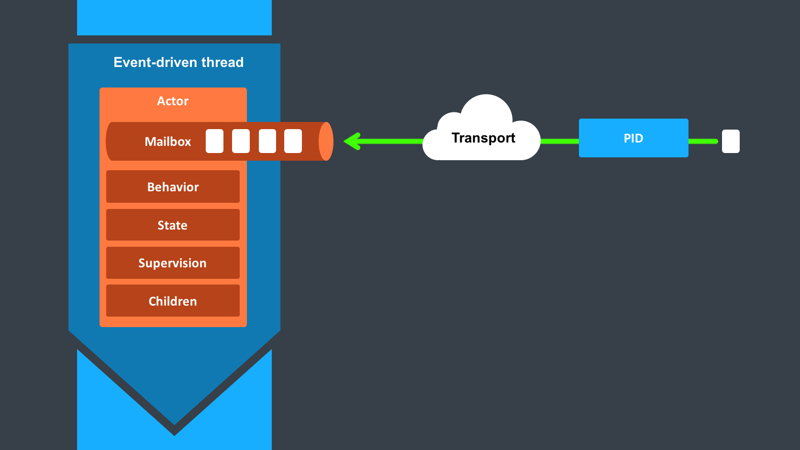

# Actors

actor是state(状态)，behavior(行为)，mailbox(邮箱)，children(子项)和supervisor strategy(suerpvisor策略)的容器。
所有这些都封装在process ID（PID）的背后。

## PID - process ID

如下所述，需要从外部屏蔽actor对象，以便从actor模型中受益。
因此，actor使用PID来表示外部对象，PID是可以自由传递而不受限制的对象。
无论是内部对象还是外部对象都可以利用透明性来实现所有操作：比如重新启动actor，而无需更新actor的引用；将实际的actor对象放置在远程主机上；向完全不同的应用程序中的actor发送消息。
但是最重​​要的是，除非actor不明智地自己发布信息，否则不可能从外部查看actor并掌握其状态。

阅读更多：PID

## State（状态）

actor对象通常将包含一些变量，这些变量反映了actor可能处于的状态。这可以是显式状态机（例如，FSM模块），也可以是计数器，侦听器集，待定的请求等。这些数据让actor产生价值，必须保护他们免受其他actor的腐败。
好消息是，在Proto.Actor中，每个actor都有自己的轻量级线程，该线程与系统的其余部分完全隔离。
这意味着您不必编写锁来同步访问对象，只需编写actor代码，而无需担心并发问题。

在幕后，Proto.Actor将在一组真实的线程上运行一组actor，通常，许多actor共享一个线程，并且随后可能会在不同的线程上处理一个actor的后续调用。 
Proto.Actor确保此实现细节不会影响处理actor状态的单线程。

对于actor来说，状态私有化至关重要，状态不一致会导致致命性的问题。
当actor失败并由其supervisor重新启动时，将像从头创建actor一样从头开始创建状态。
之所以这么做，这是为了使系统具有自我修复的能力。

（可选）通过持久化收到的消息，我们可以在actor重新启动后重播它们，以此将actor自动恢复到重新启动前的状态（请参阅持久性）。

## Behavior （行为）

每次处理消息时，都会将消息与actor的当前行为进行匹配。
行为是指一种功能，它定义了在该时间点对消息做出反应所要采取的动作。
如果客户端通过了鉴权，则转发请求，否则拒绝。
这种行为可能会随着时间而改变，例如，因为不同的客户端会随着时间的流逝获得授权，或者因为actor可能会短暂进入“服务中断”模式，然后恢复使用。
行为的变更是通过编码将actor的行为状态修改为另外一个行为状态实现的，又或者可以在运行时将其自身换出，请参见“become”和“unbecome”的操作。
但是，在构造actor对象期间定义的初始行为是特殊的，因为actor的重新启动会将其行为重置为该初始行为。

阅读更多：Behavior

## Mailbox（邮箱）

actor的目的是处理消息，这些消息是从其他actor（或从actor系统外部）发送给actor的。
连接发送者和接收者的部分是actor的邮箱：每个actor都只有一个邮箱，所有发送者都将他们的消息放入该邮箱。
排队按发送操作的时间顺序进行，这意味着从不同actor发送的消息在运行时可能没有定义的顺序，这是因为跨线程分配actor的明显随机性。
另一方面，从同一个actor向同一个目标发送多个消息将使它们以相同顺序排队。

有几种不同的邮箱实现可供选择，默认的是FIFO：actor处理的消息的顺序与入队的顺序匹配。
通常，这是一个很好的默认设置，但是应用程序可能需要将某些消息优先于其他消息。
在这种情况下，优先级邮箱将不总是排在最后，而是排在邮件优先级给定的位置，该位置甚至可能在最前面。
使用这种队列时，处理的消息顺序自然会由队列的算法定义，通常不是FIFO。

Proto.Actor与其他一些actor模型实现不同的一个重要功能是，当前行为必须始终处理下一个出队消息，而无需扫描邮箱以查找下一个匹配的消息。
除非覆盖此行为，否则处理失败的消息通常将被视为失败。

了解更多：Mailbox

## Children（子项）

每个actor都可能是suerpvisor：如果它创建了用于委派子任务的Children，它将自动对其进行监督。
Children列表保留在actor的上下文中，actor可以直接访问它。
通过创建Context.Spawn(...)或停止Child.Stop()子项来完成对该列表的修改，这些操作会立即生效。
实际的创建和终止操作以异步方式在背后发生，因此它们不会阻塞其suerpvisor。

## Suerpvisor（策略）

actor的最后一块是其处理children故障的策略。
Proto.Actor中透明地对故障进行处理，对每个故障采用Supervision和Monitoring中描述的策略之一。
由于此策略是构造actor系统的基础，因此一旦创建actor，就无法更改它。

考虑到每个actor只有一个这样的策略，这意味着，如果对actor的各个child应用不同的策略，则应将这些children与策略组合在中层suerpvisor的下方，将任务分解为子任务，并根据策略再次选择actor系统。

阅读更多：Supervisor

## actor终止时

一旦actor终止，即以无法通过重新启动方式修复故障、自身停止或由其suerpvisor停止，它将释放其资源，将其邮箱中的所有剩余消息发送到系统的Dead Letter Mailbox中，该Mailbox会将消息作为DeadLetters转发给EventStream。
Dead Letter Mailbox会在actor的引用中用系统邮箱替换自身的邮箱，将所有新消息作为DeadLetters重定向到EventStream。
不过，这是尽力而为的，不要为了实现“保证交付”而依赖这个方法。

阅读更多：Eventstream，Deadletter