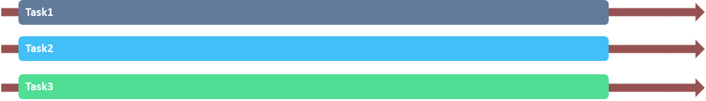

# 术语和概念

在本章中，我们尝试建立一套通用术语，来解释Proto.Actor针对并发、分布式系统通信机制的理论。
请注意，其中的许多术语，没有统一的定义。
我们只是将在Proto.Actor文档中出现的概念进行定义。

## 并发与并行

并发和并行性是相近的概念，但是有细微的差异。
并发意味着即使两个或多个任务可能未同时执行，它们也正在持续推荐。
例如，这可以通过时间分片来实现，在时间分片中，部分任务按顺序执行并与其他任务的一部分混合。
另一方面，当任务可以真正同时执行时，就会出现并行性。

### 并发

### 并行

## 异步与同步

如果在方法返回值或引发异常之前调用者无法继续今昔，则该方法调用被视为同步。
另一方面，异步调用允许调用者在有限数量的操作后继续进行，
并且可以通过一些其他机制（可能是注册的回调，Future或消息）来发出信号，
告诉调用者该方法已经完成。

同步API可以使用阻塞来实现同步，但这不是必须的。
占用大量CPU的任务可能会产生与阻塞类似的行为。
通常，最好使用异步API，因为它们可以保证系统能够继续运行。 
Actor本质上是异步的：actor可以在消息发送后继续前进，而无需等待实际的传递发生。

## 非阻塞与阻塞

如果一个线程的延迟可以无限期地延迟其他一些线程的延迟，我们将其称为阻塞。
比如说：有一个线程使用互斥锁独占资源。
如果线程无限期地占用资源（例如，意外地运行无限循环），则等待该资源的其他线程将无法进行。
相反，非阻塞意味着没有线程能够无限期地延迟其他线程。

非阻塞操作比阻塞操作更可取，因为当包含阻塞操作时，系统的总体进度无法得到保证。

## 死锁vs.饥饿vs.活锁

当几个actor互相等待以达到特定状态以便能够继续进行时，就会出现死锁。
由于没有其他actor达到某种状态（“ Catch-22”问题），他们都无法继续执行，因此所有受影响的子系统都将停滞。
死锁与阻塞密切相关，因为actor线程能够无限期地延迟其他线程的进程。

在僵局的情况下，没有actor可以继续进行，另一方面，
当有actor可以执行时却可能会发生饥饿，可能会有一个或多个actor无法继续执行。
饿死的典型场景是采用朴素的调度算法，该算法总是选择高优先级任务而不是低优先级任务。
如果传入的高优先级任务的数量始终足够高，则将永远不会完成低优先级的任务。

活锁类似于死锁，因为没有actor在执行。
不过，区别在于，actor会不停滞在等待他人进步的状态中，
而是不断改变他们的状态。
比如说有两个actor，它们有相同的可用资源，
他们每个人都试图获取资源，但是他们也会检查对方是否也需要资源。
如果其他actor请求了该资源，则他们会尝试获取该资源的另一个实例。
在最糟糕的情况下，可能会发生两个actor在两个资源之间互相“反弹”，
从不获取资源，而是总是屈服于对方的情况。

## 竞态条件

当外部事件的不确定性可能违反有关一组事件的顺序的假设时，我们称其为竞态条件。
当多个线程共享可变状态时，通常会出现竞态条件，并且线程的操作可能会交织，从而导致意外行为。
尽管这是一种常见情况，但不是所出现共享状态就一定会出现竞态条件。
比如说，一个客户端向服务器发送无序数据包（例如UDP数据报）P1，P2。
由于数据包可能会通过不同的网络路由传播，因此服务器可能首先接收P2，然后接收P1。
如果消息不包含有关其发送顺序的信息，则服务器无法确定它们是以什么顺序发送的。
如何数据包具备顺序相关的含义，可能会导致争用情况。

> 注意
Proto.Actor保证一对actor之间发送的消息的顺序是始终相同的。

请参阅[消息传递可靠性](7_message_delivery_reliability.md)

## 非阻塞担保（进程条件）

如前几节所述，由于多种原因，阻塞是不可取的，它将导致死锁、降低系统的吞吐量。
在以下各节中，我们将讨论具有不同强度的各种非阻塞特性。

### wait-freedom 无等待

如果保证每个调用都可以在有限的步骤中完成，则该方法无需等待。
如果某个方法被限制为不等待，则步骤数将具有有限的上限。

从这个定义可以得出，wait-free的方法永远不会阻塞，因此不会发生死锁。
此外，由于每个actor都可以在有限的步骤之后（调用结束后）进行，因此wait-free方法不会出现饥饿。

### lock-freedom 无锁

与wait-free相比，lock-free是一个较弱的属性。
在lock-free调用的情况下，某些方法通常会无限地以有限的步骤数完成。
此定义意味着lock-free调用不可能发生死锁。
另一方面，仅保证某些调用以有限的步数完成，还不足以保证它们最终都将完成。
换句话说，lock-free无法保证不会饥饿。

### obstruction-freedom 无障碍

obstruction-free是此处讨论的最弱的非阻塞保证。
如果在某个时间点之后隔离执行该方法（其他线程不执行任何步骤，例如变为挂起），则该方法将以无数个步骤结束，则称为obstruction-free方法。
所有lock-free的对象都是obstruction-free的，但不是所有的obstruction-free能够做到lock-free

乐观并发控制（OCC）方法通常是obstruction-free的。 
OCC方法是，每个actor都尝试在共享对象上执行其操作，但是如果actor检测到与其他对象的冲突，则会回滚所做的修改，并根据某个时间表再次尝试。
如果同一时间，其中只有一名actor是尝试者，则该操作将成功。