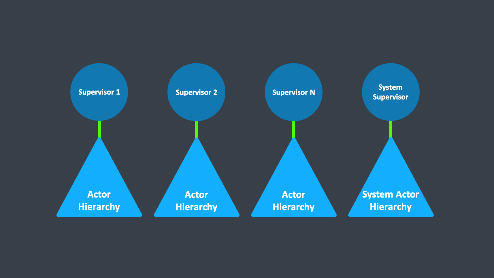

# Supervision 监督

本文档概述了Supervision背后的概念，以及它对运行时actor意味着什么。

## Supervision的意义

Supervision描述了actor之间的依赖关系：Supervior将任务委托给下属，因此必须对他们的失败做出响应。
当下属检测到故障（即引发异常）时，它会挂起自身及其所有下属，并向其Supervisor发送一条消息，表示发生故障。
根据要监督的工作的性质和失败的性质，Supervisor可以选择以下四个选项：

- 恢复下属，保持其内部累积状态
- 重新启动下属，清除其累积的内部状态
- 永久停止下属
- 将故障升级到层次结构中的下一个父级，从而使自身失败

始终将actor视为监督层次结构的一部分，这一点很重要，
这可以解释第四选择的存在（因为Supervisor也从属于更高级别的另一个Supervisor），
并且对前三个方面有影响：恢复actor可以恢复它所负责的所有下属，
重新启动actor需要重新启动其所有下属（但请参见下文以了解更多详细信息），
类似地终止actor也将终止其所有下属。
值得注意的是，Actor的Restarting事件的默认行为是在重新启动之前终止其所有Children，但是可以重写此钩子。
递归重启适用于执行此钩子后剩下的所有Children。

每个Supervisor都配置有将所有可能的故障原因（即异常）转换为上述四个选择之一的功能；
值得注意的是，此功能不会将失败actor的标识作为输入。
这么做看起来似乎很不灵活，比如说可能会希望将不同的策略应用于不同的下属。
我们需要了解的是，监督递归处理故障的。
如果您试图在一个级别上做太多事情，会将逻辑变得复杂，因此建议新增一个级别的监督来处理这种情况。

Proto.Actor执行一种称为“家长监督”（parental supervision）的特定形式。
actor只能由其他actor创建（由库提供顶级actor），并且每个创建的actor都受其父级监督。
这种限制使得actor监督层次变得比较隐式，并鼓励使用合理的设计决策。
应该注意的是，这也保证了actor不能被孤立，或者从外部与Supervisor隔离，否则可能会使Supervisor不知情。
另外，这为actor应用程序（的子树）产生了自然而干净的关闭过程。

> 警告: 
> 与监督相关的父子通信通过特殊的系统消息和邮箱来传递，与用户消息分开。
这意味着相对于普通邮件排序，与监督相关的事件不是确定性的。通常，用户无法影响正常消息的顺序和故障通知。
有关详细信息和示例，请参见“讨论：消息排序”部分。

## 顶级Supervisor

Proto.Actor中的Supervisor是实现Supervisor接口的任何类型。
这意味着actor和非actor都可以成为Supervisor。

在Proto.Actor的顶部，有N个非基于actor的Supervisor。

重新启动意味着什么

当向actor显示在处理某些消息时发生故障时，导致故障的原因可分为三类：

收到的特定消息的系统性（即编程）错误

处理消息期间使用的某些外部资源（暂时）失败

actor的内部状态已损坏

除非可以明确识别出故障，否则不能排除第三个原因，这导致需要清除内部状态的结论。
如果Supervisor决定其其他孩子或本身不受腐败影响，例如
由于有意识地应用了错误内核模式-因此最好重新启动children。
这是通过创建基础Actor类的新实例并将失败的实例替换为childrenPID中的新实例来完成的；
这样做的能力是将actor封装在特殊引用中的原因之一。
然后，新的actor恢复对其邮箱的处理，这意味着在actor本身之外看不到重新启动，但值得注意的例外是，发生故障的消息未得到重新处理。

重新启动期间事件的确切顺序如下：

暂停actor（这意味着直到恢复为止，它不会处理正常的消息）。

调用旧实例的PreRestart挂钩（默认为向所有子节点发送终止请求并调用postStop）

等待在PreRestart期间被请求终止的所有children（使用context.Stop（））实际终止；
就像所有actor操作一样，这是不阻塞的，最后一个被杀死的孩子的终止通知将影响到下一步的进度。

通过再次调用原始提供的工厂来创建新的actor实例。

在新实例上调用PostRestart（默认情况下也称为PreStart）

向所有未在步骤3中杀死的孩子发送重启请求；
重新启动的children将从第2步开始递归地执行相同的过程

恢复actor。

生命周期监控的含义

注意

Proto.Actor中的生命周期监视通常称为DeathWatch

与上述父母与孩子之间的特殊关系相反，每个actor可以监视其他任何actor。
由于actor从完全活跃的创建中脱颖而出，并且重新启动在受影响的Supervisor之外是不可见的，因此唯一可用于监视的状态更改是从活跃到死亡的过渡。
因此，监视用于将一个actor与另一个actor联系起来，以便它可以对另一actor的终止做出反应，这与对失败做出反应的监督相反。

生命周期监视是通过监视actor接收到的Terminated消息实现的，如果没有其他处理，默认行为是抛出特殊的DeathPactException。
为了开始侦听终止的消息，请调用Context.Watch（targetPID）。
要停止监听，请调用Context.Unwatch（targetPID）。
一个重要的特性是，无论监视请求和目标终止的发生顺序如何，都将传递消息，即，即使在注册时目标已经死亡，您仍然会收到该消息。

如果Supervisor不能简单地重新启动其children而不得不终止它们，例如，监视，则特别有用。
在actor初始化期间发生错误的情况下。
在这种情况下，它应该监视这些孩子并重新创建他们，或者安排自己稍后再试一次。

另一个常见的用例是，actor在没有外部资源的情况下需要失败，外部资源也可能是其自己的孩子之一。
如果第三方通过pid.Stop（）方法或发送PoisonPill终止了孩子，那么Supervisor很可能会受到影响。

一对一策略与一对多策略

Proto.Actor附带两种监督策略：OneForOneStrategy和AllForOneStrategy。
两者都配置有从异常类型到监管指令的映射（请参见上文），并限制了在终止children之前允许children失败的频率。
它们之间的区别在于，前者仅将获得的指令应用于失败的孩子，而后者也将其应用于所有兄弟姐妹。
通常，您应该使用OneForOneStrategy，如果没有明确指定，则这也是默认设置。

一对一

AllForOneStrategy适用于以下情况：孩子的整体之间有如此紧密的依赖性，以至于一个孩子的失败会影响另一个孩子的功能，即他们之间有着千丝万缕的联系。
由于重新启动不能清除邮箱，因此通常最好在发生故障时终止children，并通过Supervisor明确地重新创建它们（通过观察children的生命周期）；
否则，您必须确保任何actor都不会收到在重新启动之前排队但随后进行处理的消息。

一劳永逸

通常情况下，停止一个孩子（即不响应失败）不会自动将所有其他孩子终止为多对一策略；
这可以通过观察它们的生命周期来轻松完成：如果Supervisor未处理Terminated消息，它将引发DeathPactException，这将（取决于其Supervisor）将其重新启动，并且默认的PreRestart操作将终止所有children。
当然，这也可以明确地处理。